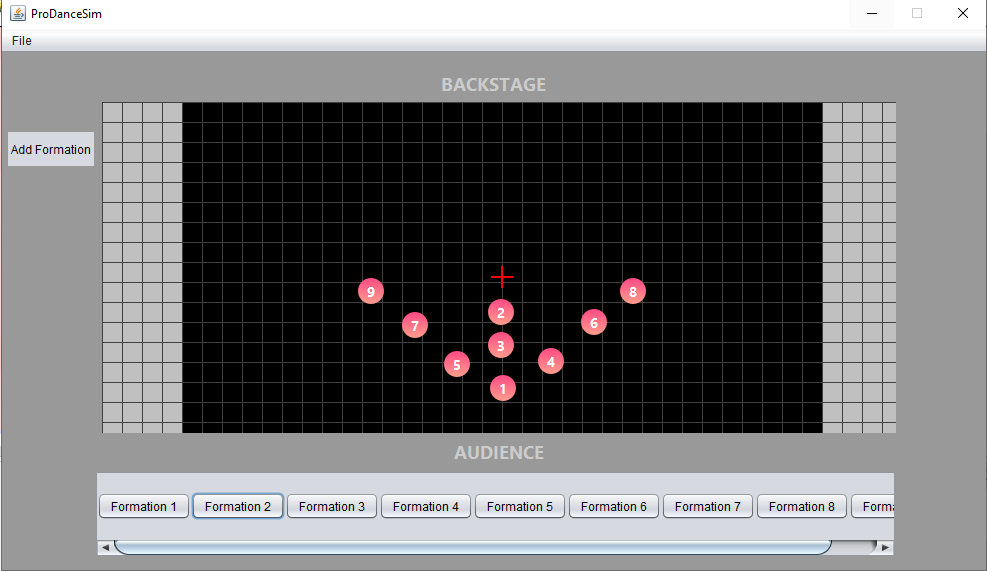
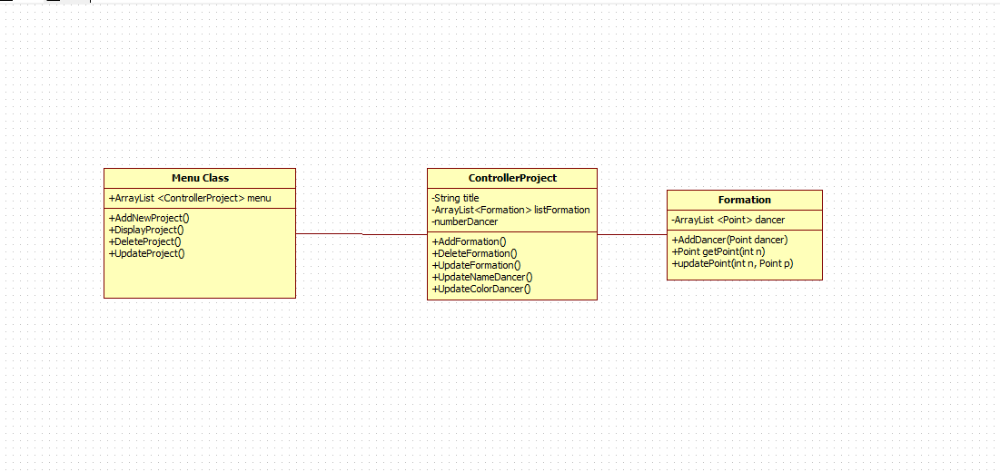

# ProDanceSim

* Bài tập cuối khóa JAVA CORE của CLB Lập Trình PTIT.
* Tên dự án: ProDanceSim
* Người thực hiện: Nguyễn Thị Như Quỳnh
* Ứng dụng giúp vẽ đội hình và chỉnh sửa một cách dễ dàng hơn

## Authors
* @milometqua
## Demo
* Link video: https://www.youtube.com/watch?v=K-GWFRMAegc


## Features
* Chọn số thành viên muốn sắp xếp
* Chỉnh sửa, thêm các đội hình
## Requirements

## Installation
Cách cài đặt dự án
```
  1. Clone dự án
  2. Chạy ứng dụng
```
## UML
